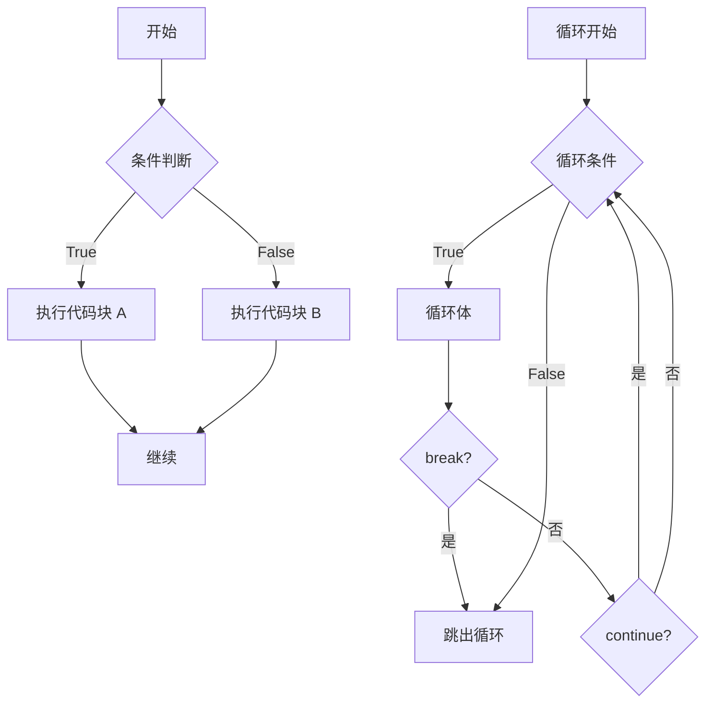

# 流程控制

Python 提供了多种流程控制语句，包括条件语句、循环语句和跳转语句。

## 条件语句

### if-elif-else

```python
# 基本语法
score = 85

if score >= 90:
    grade = "A"
elif score >= 80:
    grade = "B"
elif score >= 70:
    grade = "C"
elif score >= 60:
    grade = "D"
else:
    grade = "F"

print(f"成绩等级: {grade}")

# 单行 if（三元运算符）
age = 20
status = "成年" if age >= 18 else "未成年"

# 多条件
x, y = 5, 10
if x > 0 and y > 0:
    print("两者都为正数")

if x > 0 or y > 0:
    print("至少有一个为正数")

if not (x < 0):
    print("x 不是负数")
```

### 嵌套条件

```python
# 嵌套 if 语句
age = 25
has_ticket = True

if age >= 18:
    if has_ticket:
        print("可以入场")
    else:
        print("需要购票")
else:
    print("未成年不能入场")

# 使用逻辑运算符简化
if age >= 18 and has_ticket:
    print("可以入场")
elif age >= 18 and not has_ticket:
    print("需要购票")
else:
    print("未成年不能入场")
```

### match 语句（Python 3.10+）

```python
# match-case 语句
status = 404

match status:
    case 200:
        message = "OK"
    case 404:
        message = "Not Found"
    case 500:
        message = "Server Error"
    case _:
        message = "Unknown Status"

print(message)

# 模式匹配
def describe_point(point):
    match point:
        case (0, 0):
            return "原点"
        case (0, y):
            return f"Y轴上的点 ({y})"
        case (x, 0):
            return f"X轴上的点 ({x})"
        case (x, y) if x == y:
            return f"对角线上的点 ({x}, {y})"
        case (x, y):
            return f"普通点 ({x}, {y})"

print(describe_point((0, 0)))    # 原点
print(describe_point((0, 5)))    # Y轴上的点 (5)
```

## 循环语句

### for 循环

```python
# 遍历序列
fruits = ["apple", "banana", "cherry"]
for fruit in fruits:
    print(fruit)

# 遍历字典
person = {"name": "Alice", "age": 25}
for key in person:
    print(f"{key}: {person[key]}")

# 遍历键值对
for key, value in person.items():
    print(f"{key}: {value}")

# 使用 range()
for i in range(5):
    print(i)  # 0, 1, 2, 3, 4

for i in range(2, 10, 2):
    print(i)  # 2, 4, 6, 8

# 遍历字符串
for char in "Python":
    print(char)

# 使用 enumerate() 获取索引
for index, fruit in enumerate(fruits):
    print(f"{index}: {fruit}")

# 使用 zip() 同时遍历多个序列
names = ["Alice", "Bob", "Charlie"]
ages = [25, 30, 35]
for name, age in zip(names, ages):
    print(f"{name} is {age} years old")
```

### while 循环

```python
# 基本 while 循环
count = 0
while count < 5:
    print(count)
    count += 1

# 无限循环（需要 break）
while True:
    response = input("继续吗? (y/n): ")
    if response.lower() == 'n':
        break

# while-else
count = 0
while count < 5:
    print(count)
    count += 1
else:
    print("循环正常结束")
```

### 循环控制

```python
# break：跳出循环
for i in range(10):
    if i == 5:
        break
    print(i)  # 只打印 0-4

# continue：跳过本次迭代
for i in range(5):
    if i == 2:
        continue
    print(i)  # 打印 0, 1, 3, 4

# 循环中的 else
for i in range(5):
    if i == 10:
        break
else:
    print("没有找到 10")  # 会执行

for i in range(5):
    if i == 3:
        break
else:
    print("不会执行")  # 不会执行
```

## 列表推导式

```python
# 基本列表推导式
squares = [x**2 for x in range(10)]
evens = [x for x in range(20) if x % 2 == 0]

# 嵌套列表推导式
matrix = [[i*j for j in range(3)] for i in range(3)]
# [[0, 0, 0], [0, 1, 2], [0, 2, 4]]

# 条件表达式
result = [x if x % 2 == 0 else "odd" for x in range(5)]
# ['odd', 0, 'odd', 2, 'odd']

# 字典推导式
squares_dict = {x: x**2 for x in range(5)}
# {0: 0, 1: 1, 2: 4, 3: 9, 4: 16}

# 集合推导式
even_squares = {x**2 for x in range(10) if x % 2 == 0}
# {0, 4, 16, 36, 64}

# 生成器表达式
squares_gen = (x**2 for x in range(10))
print(sum(squares_gen))  # 285
```

## pass 语句

```python
# pass 是空操作，用作占位符

# 空函数
def my_function():
    pass

# 空类
class MyClass:
    pass

# 条件占位
if condition:
    pass  # TODO: 待实现
else:
    do_something()
```

## 循环示例

```python
# 九九乘法表
for i in range(1, 10):
    for j in range(1, i + 1):
        print(f"{j}x{i}={i*j}", end="\t")
    print()

# 查找素数
def is_prime(n):
    if n < 2:
        return False
    for i in range(2, int(n**0.5) + 1):
        if n % i == 0:
            return False
    return True

primes = [x for x in range(2, 100) if is_prime(x)]
print(f"100以内的素数: {primes}")

# 斐波那契数列
def fibonacci(n):
    a, b = 0, 1
    result = []
    for _ in range(n):
        result.append(a)
        a, b = b, a + b
    return result

print(fibonacci(10))  # [0, 1, 1, 2, 3, 5, 8, 13, 21, 34]
```

## 流程控制图



## 最佳实践

::: tip 使用 for 循环而非 while

```python
# ❌ 不推荐
i = 0
while i < len(items):
    print(items[i])
    i += 1

# ✅ 推荐
for item in items:
    print(item)
```

::: tip 使用 enumerate 获取索引

```python
# ❌ 不推荐
for i in range(len(items)):
    print(i, items[i])

# ✅ 推荐
for i, item in enumerate(items):
    print(i, item)
```

::: tip 使用 dict.items() 遍历字典

```python
# ❌ 不推荐
for key in dict:
    value = dict[key]

# ✅ 推荐
for key, value in dict.items():
    ...
```
