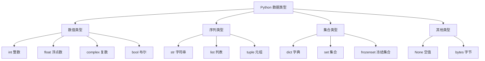

# 变量与数据类型

Python 是动态类型语言，变量无需声明类型，但了解数据类型对编写高质量代码至关重要。

## 变量

### 变量命名规则

```python
# 合法命名
name = "Alice"
user_id = 123
_is_active = True
MAX_SIZE = 100

# 非法命名
2nd_place = "second"  # 不能以数字开头
class = "Python"      # 不能使用关键字
user-name = "bob"     # 不能包含连字符
```

::: tip 命名规范（PEP 8）

- **变量/函数**：`snake_case`（小写+下划线）
- **常量**：`UPPER_CASE`
- **类名**：`PascalCase`
- **私有变量**：`_leading_underscore`
:::

### 变量赋值

```python
# 简单赋值
x = 10
name = "Python"

# 多重赋值
a = b = c = 0

# 序列解包
x, y, z = 1, 2, 3

# 交换变量（无需临时变量）
a, b = b, a

# 链式比较
x = 5
1 < x < 10  # True
```

## 基本数据类型

### 数值类型

```python
# 整数（int）
age = 25
big_number = 10**100  # 任意精度

# 浮点数（float）
pi = 3.14159
scientific = 1.23e-4  # 科学计数法

# 复数（complex）
z = 3 + 4j
real = z.real    # 3.0
imag = z.imag    # 4.0

# 布尔值（bool）
is_valid = True
is_empty = False

# 类型转换
x = int("42")        # 42
y = float("3.14")    # 3.14
z = str(123)         # "123"
```

### 类型检查

```python
# type() 返回类型
type(42)             # <class 'int'>
type("hello")        # <class 'str'>

# isinstance() 推荐用于类型检查
isinstance(42, int)           # True
isinstance("hello", (int, str))  # True

# 类型注解（Python 3.5+）
def greet(name: str) -> str:
    return f"Hello, {name}!"

age: int = 25
names: list[str] = ["Alice", "Bob"]
```

## 序列类型

### 字符串（str）

```python
# 字符串创建
s1 = 'Hello'
s2 = "World"
s3 = """Multi-line
string"""
s4 = str(123)

# 字符串格式化
name = "Alice"
age = 25

# f-string（Python 3.6+ 推荐）
message = f"My name is {name} and I'm {age} years old"

# format()
message = "My name is {} and I'm {} years old".format(name, age)

# % 格式化（旧式）
message = "My name is %s and I'm %d years old" % (name, age)

# 字符串方法
s = "Hello World"
s.lower()      # "hello world"
s.upper()      # "HELLO WORLD"
s.title()      # "Hello World"
s.strip()      # 去除首尾空格
s.split()      # ["Hello", "World"]
" ".join(["Hello", "World"])  # "Hello World"
s.replace("World", "Python")   # "Hello Python"

# 原始字符串（忽略转义）
path = r"C:\Users\name"  # "C:\Users\name"
```

### 列表（list）

```python
# 列表创建
numbers = [1, 2, 3, 4, 5]
mixed = [1, "hello", 3.14, True]
empty = []
list_from_tuple = list((1, 2, 3))

# 列表索引
numbers[0]     # 1（第一个元素）
numbers[-1]    # 5（最后一个元素）
numbers[1:3]   # [2, 3]（切片）
numbers[::2]   # [1, 3, 5]（步长为2）
numbers[::-1]  # [5, 4, 3, 2, 1]（反转）

# 列表方法
numbers.append(6)        # 添加到末尾
numbers.insert(0, 0)     # 在指定位置插入
numbers.extend([7, 8])   # 扩展列表
numbers.remove(1)        # 移除指定值
numbers.pop()            # 移除并返回最后一个元素
numbers.index(3)         # 返回值的索引
numbers.count(3)         # 统计值出现次数
numbers.sort()           # 排序
numbers.reverse()        # 反转

# 列表推导式
squares = [x**2 for x in range(10)]
evens = [x for x in range(20) if x % 2 == 0]
```

### 元组（tuple）

```python
# 元组创建（不可变）
coordinates = (3, 4)
single = (1,)        # 单元素元组需要逗号
empty = ()
from_tuple = tuple([1, 2, 3])

# 元组解包
x, y = coordinates
a, b, c = (1, 2, 3)

# 命名元组
from collections import namedtuple
Point = namedtuple('Point', ['x', 'y'])
p = Point(3, 4)
p.x  # 3
p.y  # 4
```

## 集合类型

### 字典（dict）

```python
# 字典创建
person = {
    "name": "Alice",
    "age": 25,
    "city": "Beijing"
}

# 访问和修改
person["name"]           # "Alice"
person["email"] = "alice@example.com"  # 添加
person["age"] = 26       # 修改

# 字典方法
person.keys()            # dict_keys(['name', 'age', 'city'])
person.values()          # dict_values(['Alice', 25, 'Beijing'])
person.items()           # dict_items([('name', 'Alice'), ...])
person.get("name", "Unknown")  # 安全访问，可指定默认值
person.pop("age")        # 移除并返回值
person.update({"age": 26})  # 更新字典

# 字典推导式
squares = {x: x**2 for x in range(5)}
# {0: 0, 1: 1, 2: 4, 3: 9, 4: 16}
```

### 集合（set）

```python
# 集合创建（无序、唯一）
numbers = {1, 2, 3, 2, 1}  # {1, 2, 3}
empty = set()
from_list = set([1, 2, 2, 3])  # {1, 2, 3}

# 集合操作
a = {1, 2, 3}
b = {3, 4, 5}

a | b     # 并集: {1, 2, 3, 4, 5}
a & b     # 交集: {3}
a - b     # 差集: {1, 2}
a ^ b     # 对称差集: {1, 2, 4, 5}

# 集合方法
a.add(4)           # 添加元素
a.remove(1)        # 移除元素（不存在会报错）
a.discard(10)      # 安全移除（不存在不会报错）
a.clear()          # 清空集合
```

## 类型转换

```python
# 转换为整数
int("42")          # 42
int(3.14)          # 3
int(True)          # 1

# 转换为浮点数
float("3.14")      # 3.14
float(42)          # 42.0

# 转换为字符串
str(123)           # "123"
str(3.14)          # "3.14"

# 转换为列表
list("hello")      # ['h', 'e', 'l', 'l', 'o']
list((1, 2, 3))    # [1, 2, 3]

# 转换为元组
tuple([1, 2, 3])   # (1, 2, 3)

# 转换为集合
set([1, 2, 2, 3])  # {1, 2, 3}

# 转换为字典
dict([["a", 1], ["b", 2]])  # {'a': 1, 'b': 2}
```

## None 类型

```python
# None 表示空值
x = None

# 检查是否为 None
if x is None:
    print("x is None")

if x is not None:
    print("x is not None")

# 函数默认返回 None
def function_with_no_return():
    pass

result = function_with_no_return()
print(result)  # None
```

## 数据类型总结



## 最佳实践

::: tip 类型提示

```python
from typing import List, Dict, Optional, Union

# 基本类型提示
def process(items: List[int]) -> Dict[str, int]:
    return {"count": len(items)}

# 可选类型
def find_user(user_id: int) -> Optional[str]:
    return None

# 联合类型
def process_value(value: Union[int, str]) -> str:
    return str(value)

# Python 3.10+ 新语法
def process(items: list[int]) -> dict[str, int]:
    return {"count": len(items)}
```

::: warning 类型陷阱

```python
# 可变默认参数陷阱（❌ 错误）
def append_to(item, items=[]):
    items.append(item)
    return items

# 正确做法
def append_to(item, items=None):
    if items is None:
        items = []
    items.append(item)
    return items
```
