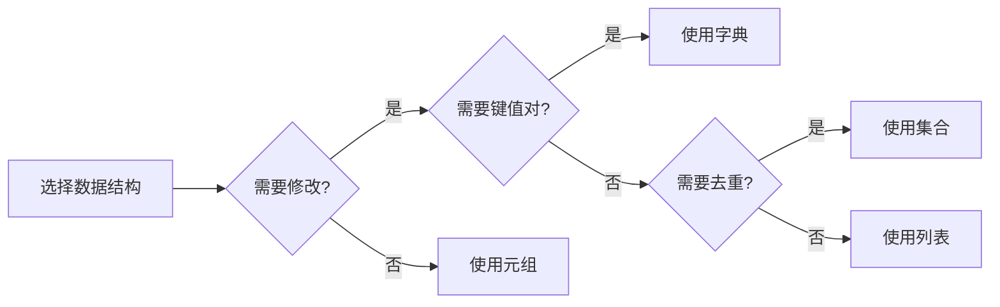

# 数据结构

掌握 Python 内置数据结构：列表、元组、字典、集合。

## 学习内容

<VPCard
  title="列表"
  desc="可变序列，增删改查、切片、排序"
  logo="https://api.iconify.design/ri/list-ordered.svg"
  link="/langs/python/02-data-structures/lists.md"
/>

<VPCard
  title="元组"
  desc="不可变序列，命名元组"
  logo="https://api.iconify.design/ri/link.svg"
  link="/langs/python/02-data-structures/tuples.md"
/>

<VPCard
  title="字典"
  desc="键值对集合，字典方法、字典推导式"
  logo="https://api.iconify.design/ri/book-mark-line.svg"
  link="/langs/python/02-data-structures/dicts.md"
/>

<VPCard
  title="集合"
  desc="无序不重复元素，集合运算"
  logo="https://api.iconify.design/ri/checkbox-blank-circle-line.svg"
  link="/langs/python/02-data-structures/sets.md"
/>

## 数据结构对比

| 特性 | 列表 | 元组 | 字典 | 集合 |
|------|------|------|------|------|
| 符号 | `[]` | `()` | `{}` | `set()` |
| 可变性 | 可变 | 不可变 | 可变 | 可变 |
| 有序性 | 有序 | 有序 | 有序(3.7+) | 无序 |
| 可重复 | 可重复 | 可重复 | 键唯一 | 不可重复 |
| 索引 | 支持 | 支持 | 键索引 | 不支持 |

## 使用场景

