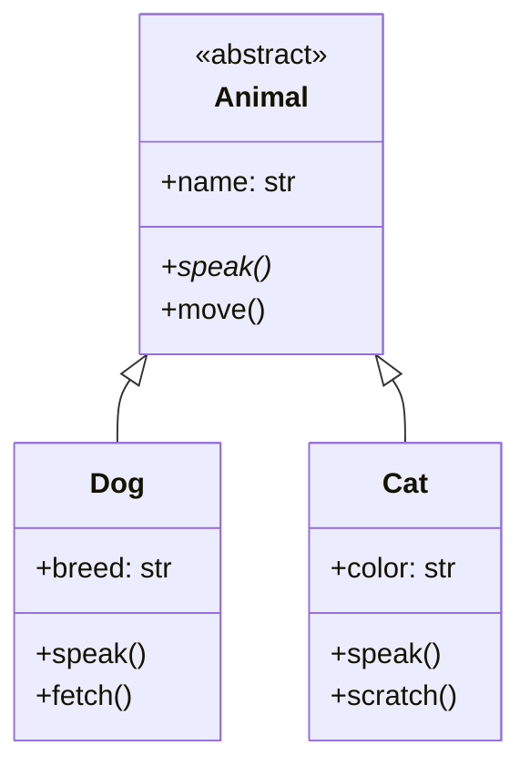

# 面向对象编程

掌握 Python 面向对象编程：类、对象、继承、多态、魔术方法。

## 学习内容

<VPCard
  title="类与对象"
  desc="类定义、构造函数、实例方法、类方法、静态方法"
  logo="https://api.iconify.design/ri/shape-line.svg"
  link="/langs/python/04-oop/classes.md"
/>

<VPCard
  title="继承"
  desc="单继承、多继承、MRO、super()"
  logo="https://api.iconify.design/ri/git-branch-line.svg"
  link="/langs/python/04-oop/inheritance.md"
/>

<VPCard
  title="多态与封装"
  desc="方法重写、抽象类、属性封装"
  logo="https://api.iconify.design/ri/shuffle-line.svg"
  link="/langs/python/04-oop/polymorphism.md"
/>

<VPCard
  title="魔术方法"
  desc="运算符重载、对象表示、容器协议"
  logo="https://api.iconify.design/ri-magic-line.svg"
  link="/langs/python/04-oop/magic-methods.md"
/>

<VPCard
  title="元类与属性"
  desc="property、描述器、元类"
  logo="https://api.iconify.design/ri/settings-4-line.svg"
  link="/langs/python/04-oop/metaclasses.md"
/>

## OOP 核心概念

## 设计原则

::: tip SOLID 原则

1. **S**RP - 单一职责原则
2. **O**CP - 开闭原则
3. **L**SP - 里氏替换原则
4. **I**SP - 接口隔离原则
5. **D**IP - 依赖倒置原则
:::
