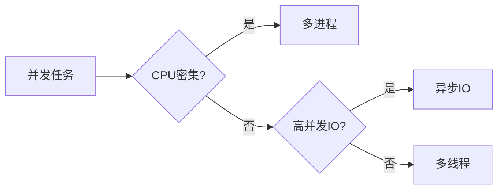

# 并发编程

掌握 Python 并发编程：多线程、多进程、异步编程。

## 学习内容

<VPCard
  title="多线程"
  desc="threading 模块、线程同步、线程安全"
  logo="https://api.iconify.design/ri/team-line.svg"
  link="/langs/python/06-concurrency/threading.md"
/>

<VPCard
  title="多进程"
  desc="multiprocessing 模块、进程间通信"
  logo="https://api.iconify.design/ri-cpu-line.svg"
  link="/langs/python/06-concurrency/multiprocessing.md"
/>

<VPCard
  title="异步编程"
  desc="asyncio、协程、事件循环"
  logo="https://api.iconify.design/ri-refresh-line.svg"
  link="/langs/python/06-concurrency/asyncio.md"
/>

<VPCard
  title="并发工具"
  desc="线程池、进程池、并发原语"
  logo="https://api.iconify.design/ri-tools-line.svg"
  link="/langs/python/06-concurrency/concurrent-futures.md"
/>

## 并发模型对比

| 特性 | 多线程 | 多进程 | 异步IO |
|------|--------|--------|--------|
| 模块 | `threading` | `multiprocessing` | `asyncio` |
| GIL限制 | 受限 | 不受限 | 不受限 |
| 内存共享 | 共享 | 独立 | 共享 |
| 适用场景 | IO密集 | CPU密集 | 高IO并发 |
| 创建开销 | 低 | 高 | 低 |

## 选择建议

## GIL 说明

::: warning 全局解释器锁（GIL）

Python 的 GIL 确保同一时刻只有一个线程执行 Python 字节码：
- **不影响**：IO 密集型任务（网络、文件）
- **影响**：CPU 密集型任务（计算）

解决方案：
1. 使用 `multiprocessing` 绕过 GIL
2. 使用 C 扩展（NumPy、Cython）
3. 使用异步编程（asyncio）
:::
