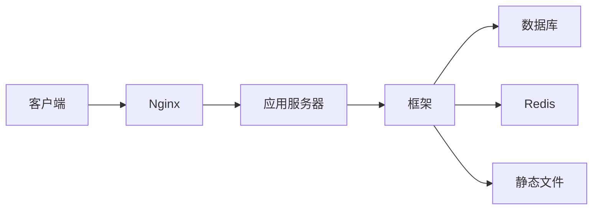

# Web 开发

使用 Python 构建 Web 应用，掌握主流框架和 RESTful API 设计。

## 学习内容

<VPCard
  title="Flask 框架"
  desc="轻量级 Web 框架、路由、模板、蓝图"
  logo="https://api.iconify.design/simple-icons/flask.svg"
  link="/langs/python/08-web/flask.md"
/>

<VPCard
  title="Django 框架"
  desc="全栈框架、MTV架构、ORM、Admin"
  logo="https://api.iconify.design/simple-icons/django.svg"
  link="/langs/python/08-web/django.md"
/>

<VPCard
  title="FastAPI"
  desc="现代异步框架、自动文档、类型验证"
  logo="https://api.iconify.design/simple-icons/fastapi.svg"
  link="/langs/python/08-web/fastapi.md"
/>

<VPCard
  title="数据库操作"
  desc="SQLAlchemy、数据库迁移、Redis"
  logo="https://api.iconify.design/ri/database-2-line.svg"
  link="/langs/python/08-web/database.md"
/>

## 框架对比

| 特性 | Flask | Django | FastAPI |
|------|-------|--------|---------|
| 类型 | 微框架 | 全栈框架 | 现代框架 |
| 学习曲线 | 低 | 中高 | 低中 |
| 灵活性 | 高 | 中 | 高 |
| 内置功能 | 基础 | 丰富 | 适中 |
| 异步支持 | 需扩展 | 4.0+ | 原生 |
| 性能 | 中 | 中 | 高 |
| 适用场景 | 小型应用 | 企业应用 | API服务 |

## Web 应用架构

## RESTful API 设计

::: tips 设计原则

1. **资源导向**：URL 表示资源
2. **HTTP 方法**：GET/POST/PUT/DELETE
3. **状态码**：200/201/204/400/404/500
4. **版本控制**：`/api/v1/users`
5. **统一响应**：JSON 格式
:::
