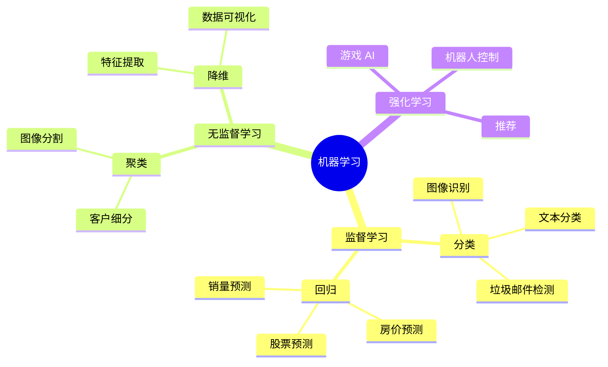

# 机器学习

使用 Python 进行机器学习和深度学习。

## 学习内容

<VPCard
  title="Scikit-learn"
  desc="传统机器学习算法、模型训练、评估"
  logo="https://api.iconify.design/simple-icons/scikitlearn.svg"
  link="/langs/python/10-ml/scikit-learn.md"
/>

<VPCard
  title="PyTorch"
  desc="深度学习框架、神经网络、自动微分"
  logo="https://api.iconify.design/simple-icons/pytorch.svg"
  link="/langs/python/10-ml/pytorch.md"
/>

<VPCard
  title="TensorFlow"
  desc="Google 深度学习框架、Keras API"
  logo="https://api.iconify.design/simple-icons/tensorflow.svg"
  link="/langs/python/10-ml/tensorflow.md"
/>

<VPCard
  title="机器学习流程"
  desc="数据预处理、特征工程、模型选择"
  logo="https://api.iconify.design/ri/git-pull-request-line.svg"
  link="/langs/python/10-ml/ml-pipeline.md"
/>

## 机器学习类型



## 框架选择

| 任务 | 推荐框架 |
|------|----------|
| 传统机器学习 | Scikit-learn |
| 深度学习研究 | PyTorch |
| 生产部署 | TensorFlow |
| 快速原型 | Keras |
| 计算机视觉 | OpenCV + PyTorch |
| 自然语言处理 | Transformers |

## 机器学习工作流

```python
from sklearn.model_selection import train_test_split
from sklearn.preprocessing import StandardScaler
from sklearn.ensemble import RandomForestClassifier
from sklearn.metrics import accuracy_score

# 1. 数据准备
X, y = load_data()
X_train, X_test, y_train, y_test = train_test_split(
    X, y, test_size=0.2, random_state=42
)

# 2. 特征工程
scaler = StandardScaler()
X_train_scaled = scaler.fit_transform(X_train)
X_test_scaled = scaler.transform(X_test)

# 3. 模型训练
model = RandomForestClassifier(n_estimators=100)
model.fit(X_train_scaled, y_train)

# 4. 模型评估
y_pred = model.predict(X_test_scaled)
accuracy = accuracy_score(y_test, y_pred)
```
