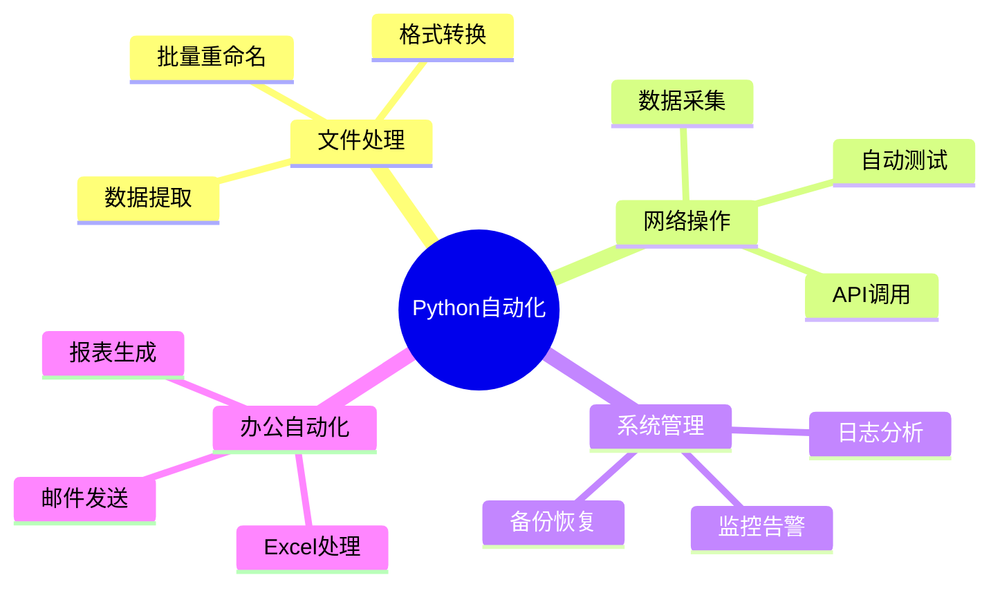

# 自动化

使用 Python 实现自动化任务：脚本、爬虫、GUI 自动化。

## 学习内容

<VPCard
  title="脚本编程"
  desc="文件操作、系统管理、定时任务"
  logo="https://api.iconify.design/ri-terminal-box-line.svg"
  link="/langs/python/11-automation/scripting.md"
/>

<VPCard
  title="网络爬虫"
  desc="Requests、BeautifulSoup、Scrapy"
  logo="https://api.iconify.design/ri-global-line.svg"
  link="/langs/python/11-automation/web-scraping.md"
/>

<VPCard
  title="GUI 自动化"
  desc="Selenium、Playwright、PyAutoGUI"
  logo="https://api.iconify.design/ri-mouse-line.svg"
  link="/langs/python/11-automation/gui-automation.md"
/>

<VPCard
  title="自动化工具"
  desc="Fabric、Ansible、Invoke"
  logo="https://api.iconify.design/ri-tools-line.svg"
  link="/langs/python/11-automation/automation-tools.md"
/>

## 自动化场景



## 爬虫技术栈

```
简单爬虫
  ↓
Requests + BeautifulSoup
  ↓
Scrapy 框架
  ↓
Selenium/Playwright (动态页面)
  ↓
分布式爬虫
```

::: tip 法律合规

爬虫开发需遵守：
1. robots.txt 协议
2. 网站服务条款
3. 数据隐私法规
4. 合理请求频率
:::
