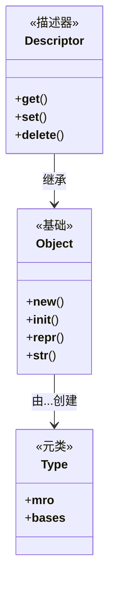

# Python 高级

深入 Python 高级特性：描述器、元类、反射、协程。

## 学习内容

<VPCard
  title="描述器协议"
  desc="描述器方法、property、cached_property"
  logo="https://api.iconify.design/ri-stack-line.svg"
  link="/langs/python/12-advanced-python/descriptors.md"
/>

<VPCard
  title="元类编程"
  desc="type、__metaclass__、ABC、动态类创建"
  logo="https://api.iconify.design/ri-code-box-line.svg"
  link="/langs/python/12-advanced-python/metaclasses.md"
/>

<VPCard
  title="反射与动态"
  desc="getattr、setattr、__import__、动态执行"
  logo="https://api.iconify.design/ri-magic-line.svg"
  link="/langs/python/12-advanced-python/reflection.md"
/>

<VPCard
  title="高级协程"
  desc="async/await 深入、任务调度、并发模式"
  logo="https://api.iconify.design/ri-refresh-line.svg"
  link="/langs/python/12-advanced-python/advanced-async.md"
/>

## Python 对象模型



## 高级特性应用

### 描述器实现

```python
class Validator:
    """属性验证描述器"""
    def __set_name__(self, owner, name):
        self.name = name

    def __get__(self, obj, owner):
        if obj is None:
            return self
        return obj.__dict__.get(self.name)

    def __set__(self, obj, value):
        if not isinstance(value, (int, float)):
            raise TypeError("Expected number")
        obj.__dict__[self.name] = value

class Person:
    age = Validator()
```

### 元类单例

```python
class Singleton(type):
    _instances = {}

    def __call__(cls, *args, **kwargs):
        if cls not in cls._instances:
            cls._instances[cls] = super().__call__(*args, **kwargs)
        return cls._instances[cls]

class Database(metaclass=Singleton):
    pass
```

::: warning 谨慎使用

高级特性功能强大但可能导致代码难以理解：
- **元类**：99% 的情况不需要
- **描述器**：优先使用 @property
- **反射**：降低代码可读性
- **动态执行**：安全隐患

仅在确实需要时使用。
:::
