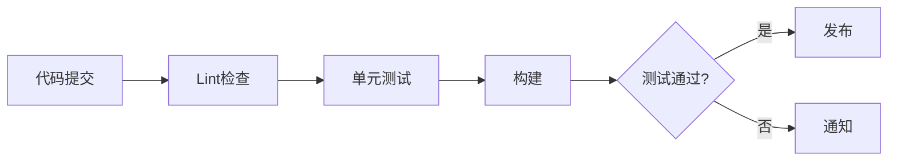

# 工程实践

Python 项目工程化：项目结构、虚拟环境、打包发布、Docker部署。

## 学习内容

<VPCard
  title="项目结构"
  desc="标准项目布局、src 布局、单模块布局"
  logo="https://api.iconify.design/ri/folder-line.svg"
  link="/langs/python/13-engineering/project-structure.md"
/>

<VPCard
  title="依赖管理"
  desc="pip、poetry、pipenv、conda"
  logo="https://api.iconify.design/ri-links-line.svg"
  link="/langs/python/13-engineering/dependency-management.md"
/>

<VPCard
  title="打包发布"
  desc="setuptools、wheel、PyPI 发布"
  logo="https://api.iconify.design/ri-upload-cloud-line.svg"
  link="/langs/python/13-engineering/packaging.md"
/>

<VPCard
  title="容器化部署"
  desc="Docker、Docker Compose、Kubernetes"
  logo="https://api.iconify.design/simple-icons/docker.svg"
  link="/langs/python/13-engineering/docker.md"
/>

## 标准项目结构

```
my_project/
├── src/
│   └── my_package/
│       ├── __init__.py
│       └── module.py
├── tests/
│   ├── __init__.py
│   └── test_module.py
├── docs/
├── pyproject.toml
├── README.md
├── LICENSE
└── .gitignore
```

## 依赖管理工具

| 工具 | 特点 | 适用场景 |
|------|------|----------|
| pip | 官方工具 | 简单项目 |
| pipenv | Pipfile、自动锁定 | 虚拟环境+依赖 |
| poetry | 现代化、依赖解析 | 新项目首选 |
| conda | 跨平台、科学计算 | 数据科学 |

## CI/CD 流程



## 最佳实践

::: tip 工程建议

1. **类型提示**：使用 mypy 静态检查
2. **代码格式**：使用 Black + isort
3. **测试覆盖**：pytest + coverage
4. **文档**：使用 Sphinx 生成文档
5. **版本控制**：语义化版本（SemVer）
:::
