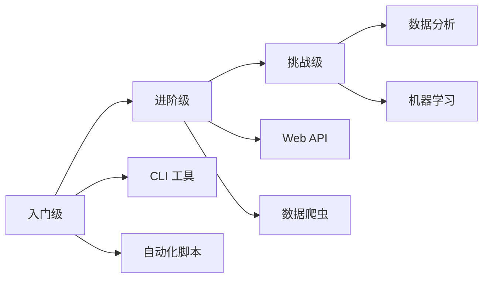

# 实战项目

通过实际项目巩固 Python 知识，提升编程能力。

## 项目列表

<VPCard
  title="命令行工具"
  desc="开发实用的 CLI 工具，掌握 argparse 和 typer"
  logo="https://api.iconify.design/ri-terminal-line.svg"
  link="/langs/python/14-practice/cli-tool/"
/>

<VPCard
  title="Web API 服务"
  desc="使用 FastAPI 构建 RESTful API"
  logo="https://api.iconify.design/ri-server-line.svg"
  link="/langs/python/14-practice/web-api/"
/>

<VPCard
  title="数据爬虫"
  desc="爬取网站数据，存储到数据库"
  logo="https://api.iconify.design/ri-download-cloud-line.svg"
  link="/langs/python/14-practice/web-scraper/"
/>

<VPCard
  title="数据分析报告"
  desc="Pandas + Matplotlib 数据可视化"
  logo="https://api.iconify.design/ri/bar-chart-line.svg"
  link="/langs/python/14-practice/data-analysis/"
/>

<VPCard
  title="自动化脚本"
  desc="文件处理、邮件发送、办公自动化"
  logo="https://api.iconify.design/ri-robot-line.svg"
  link="/langs/python/14-practice/automation/"
/>

<VPCard
  title="机器学习应用"
  desc="Scikit-learn 分类/回归实战"
  logo="https://api.iconify.design/ri-brain-line.svg"
  link="/langs/python/14-practice/ml-app/"
/>

## 项目难度

## 学习建议

::: tabs

@tab 循序渐进

从简单项目开始：

1. **CLI 工具** → 理解参数解析、文件操作
2. **自动化脚本** → 掌握系统交互
3. **Web API** → 学习 Web 开发
4. **数据爬虫** → 理解网络请求
5. **数据分析/ML** → 综合运用

@tab 代码质量

- 遵循 PEP 8 规范
- 使用类型提示
- 编写单元测试
- 添加文档字符串
- 使用版本控制

@tab 推荐资源

- **书籍**：《Python 编程：从入门到实践》
- **网站**：Real Python、Python Morsels
- **GitHub**：awesome-python
- **社区**：PyPI、Stack Overflow

:::
